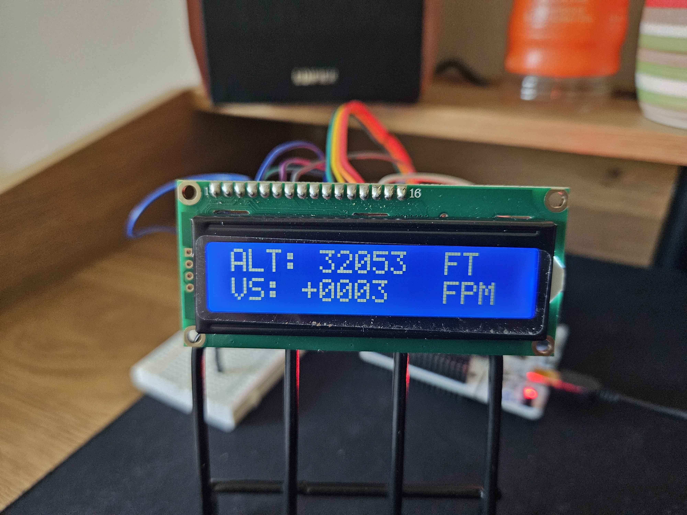
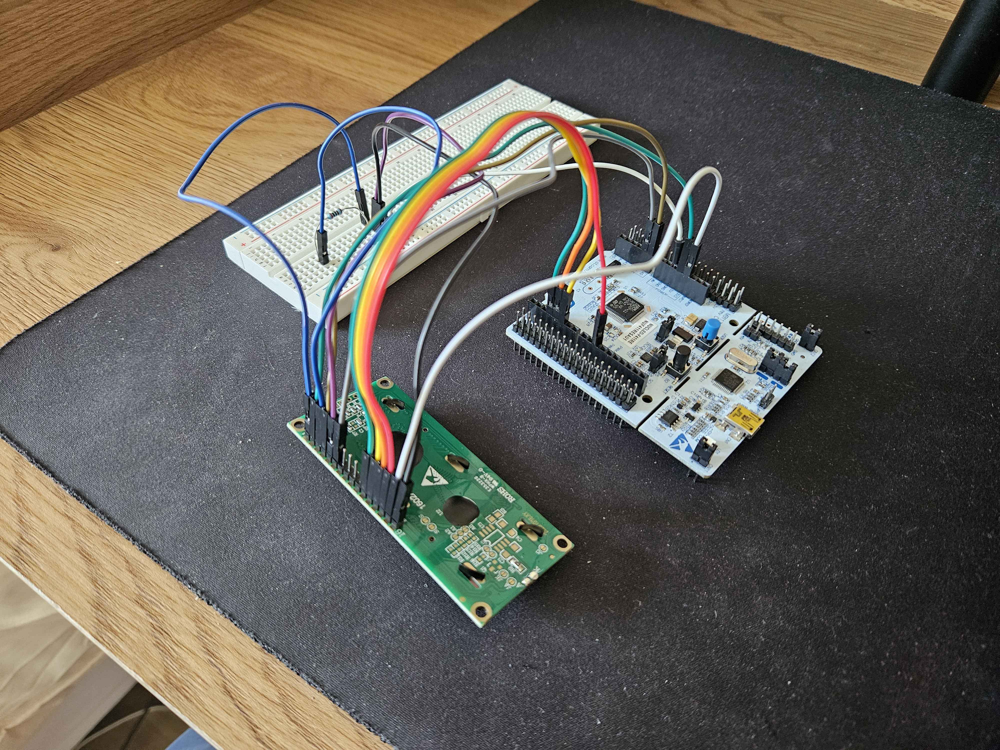
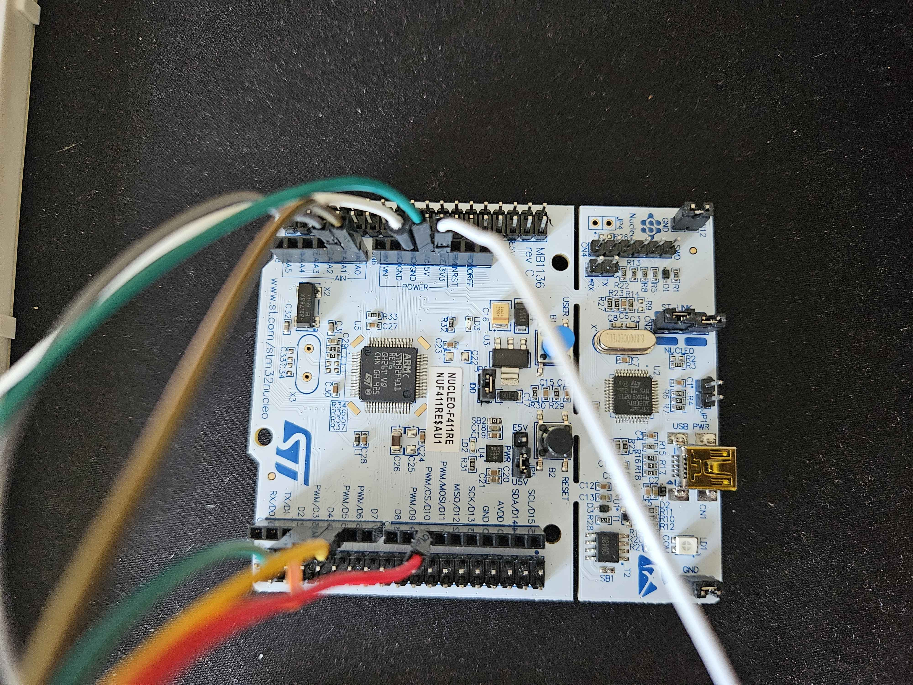
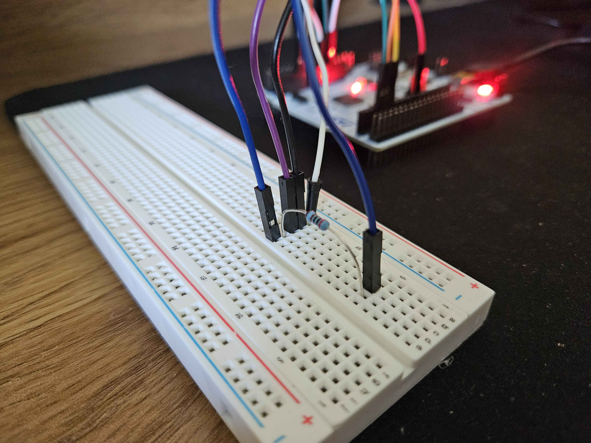

# xplane-lcd-instruments

A physical flight instrument display driven by live data from X-Plane 11, showing altitude and vertical speed on a 16x2 LCD in real time.

https://github.com/user-attachments/assets/ae702947-d8f2-4838-b333-a26c97f209ec

<table>
  <tr>
  <td></td>
  <td></td>
  <td></td>
  <td></td>
  </tr>
</table>


## Overview

This project pulls live flight data out of X-Plane 11 over UDP, relays it to a microcontroller over serial, and displays it on a cheap LCD that came with my Arduino kit.

**Pipeline:**

```
X-Plane 11  --(UDP)-->  Python relay script  --(Serial)-->  STM32 NUCLEO F411RE  --(bare-metal driver)-->  16x2 LCD
```

## Status

**Working:**
- Altitude readout
- Vertical speed readout

**Planned:**
- Speed
- Heading
- Outside air temperature
- Screen cycling to fit more parameters onto the 16x2 display (fixed altitude row + rotating secondary row)

## Hardware

- STM32 NUCLEO-F411RE
- 16x2 character LCD (HD44780-compatible), driven by a **custom bare-metal driver in 4-bit mode** - no Arduino LCD library used
- Breadboard + jumper wires

## Software

- Python 3 — UDP relay script that reads X-Plane datarefs and forwards values over serial
- STM32 firmware written at the register level using CMSIS headers (no HAL), including GPIO alternate function config and USART2 (PA2/PA3, AF7) for serial comms

## Wiring

| LCD Pin  | Connection |
|----------|------------|
| VSS      | GND |
| VDD      | 5V |
| VO       | GND (via 2kΩ resistor) |
| RS       | PA0 |
| RW       | GND |
| E        | PA1 |
| D0–D3    | unused (4-bit mode) |
| D4       | PB3 |
| D5       | PB4 |
| D6       | PB5 |
| D7       | PB6 |
| A (LED+) | 3.3V |
| K (LED−) | GND |

> Note: D4–D7 are wired to PB3–PB6, but these pins aren't physically next to eachother on the Nucleo header. Check the board's pinout diagram (or the official Nucleo-F411RE datasheet) rather than assuming sequential placement. You can also choose whichever 4 pins you want.

## Setup

1. **X-Plane 11**: Enable UDP data output for the relevant datarefs (altitude, vertical speed) under Settings → Data Output, pointed at your machine's IP. (I put in 127.0.0.1 localhost to for easy retrieval)
2. **Python relay**: `relay/relay.py` — reads the incoming UDP packets and forwards parsed values over serial to the STM32.
3. **STM32 firmware**: Flash via STM32CubeProgrammer (see `/firmware` for build instructions and Makefile).
4. Power on, start X-Plane, run the relay script — the LCD should start tracking altitude and VS live.

## Notes

Parts of the code (Python relay structure, some early debugging) were built with help from online tutorials and AI assistance. Integration, wiring, and debugging of the full pipeline was done by me. This is an ongoing learning project as my first entry into electronics and bare-metal STM32 programming.

## Challenges / Lessons Learned

Lots of problem and roadblocks as this is my first complete project on the microcontroller but here are some notable points:
- Spent a while figuring out all the flags and commands for the bare-metal toolchain to build. And when that got bothersome, copying and pasting 4 commands everytime i want to test, i made a makefile and used make to build instead.
- The Nucleo's Arduino-header pin labels **don't** map directly to the actual STM32 pins which costed me some wiring confusion early on (tho this was entirely my fault for not reading the datasheet carefully)
- Writing the LCD driver from scratch (rather than using a library) meant actually understanding the HD44780 4-bit init sequence, reading the datasheet to know exactly what to send to the LCD, navigating the challenge to send data in 4-bit instead of 8-bit, etc...
- Ghost character on the LCD the first time i sent the altitude, vertical speed template. Solved it by clearing the screen before sending the display template.
- Initially, vertical speed was writing onto altitude's line. I assumed it was a Python/data issue and spent a while debugging the relay before realizing it was actually an HD44780 timing constraint. The cursor needed some time to move to the second line before the next write. This made me realized that there were hardware limitations to consider as well, not just pure code. 

## Why

Originally, I was targeting to work in general SWE, but i felt that it was too abstract for me and i wanted something more tangible. I was always interested in aviation so i thought maybe i could incorporate compsci knowledge into it. Thus, i digged deeper and found out about avionics/embedded systems, finally pitching my professional goal towards that direction. Bought an Arduino starter kit and an STM32 (the one used for this project) to try and it's been really fun so far. This has given me hands-on experience with real-time data pipeline and low-level MCU programming by using flight sim data as a stand-in for the actual sensors that i would want to with later in life. I'll try to expand the project from here and try to make my own autopilot system with dials and such, just like in real planes maybe.
